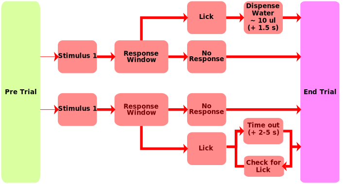

################################
Software Descriptions
################################

behaviourbox.ino
================

This program delivers sensory stimulation and opens water valve when the
animal touches the licking sensor within a certain time window.

The basic flow of the program is shown below

    
Files
-----

The header files in the behaviourbox folder contain the functions
required to run the behaviourbox code. There are currently 7 header
files: 

1. ``global_variables.h`` 
    Lists the variables that are used with global scope.
    These variables, unless explicitly stated to be internal,
    can be updated via the serial communications function.
    
2. ``prototypes.h``
    This file just lists the function names that will be defined
    in other files. It is organised such that the prototypes
    are grouped by the file that they come from, under the appropriate
    heading
    
3. ``timing.h``
    
    Contains the function used to keep all events on time. The Arduino
    code continuously asks the microcontroller how long it has been 
    running and uses a simple logic of *if the current time is > the
    time an event was supposed to happen : do event*
    
4. ``sensors.h`` 
    
    Contains the thresholding function for converting the analog lick
    sensor values to binary lick events. This function detects rising 
    edges, applies a simple digital smooth, and will play a short feed
    back tone if the ``audio`` flag is set to ``True``.

5. ``states.h``

    This file contains the functions that define the states of the 
    Arduino. All of the nodes in the flow diagram are defined here.

6. ``SerialComms.h``

    This contains a nasty series of if statements and string compares.
    The ``UpdateGlobals`` function is the backbone of this implementations
    interactivity. I have hard coded all of the variable names and
    their string representations into a long series of conditional 
    statements. The basic logic is::
    
        Given: "VariableName:Value"
        Update: VariableName = Value
    
    
7. ``single_port_setup.h``

global_variables.h
------------------

Contains definitions of all variables that are used by multiple
functions and expected to have persistent values between the functions.
These include the initialisation time, the various timing parameters, as
well as any additional options that are available.

+------------------+------------------------+
| variable         | description            |
+==================+========================+
| t_init           | not settable. This is  |
|                  | the variable that the  |
|                  | other times a measured |
|                  | relative to            |
+------------------+------------------------+
| t_noLickPer      | A time measured in     |
|                  | milliseconds. After    |
|                  | this amount of time    |
|                  | the program will break |
|                  | out of a trial if a    |
|                  | lick is detected       |
|                  | before the stimulus.   |
|                  | If the value is 0 then |
|                  | licks before the       |
|                  | stimulus are ignored   |
|                  | altogether.            |
+------------------+------------------------+
| trial_delay      | Amount of time in      |
|                  | milliseconds to delay  |
|                  | the start of a trial   |
+------------------+------------------------+
|  t_rewardDEL     | Amount of time in      |
|                  | milliseconds to delay  |
|                  | checking for licks     |
|                  | after a stimulus       |
+------------------+------------------------+
|  t_rewardDUR     | Amount of time in      |
|                  | milliseconds to check  |
|                  | for licks              |
+------------------+------------------------+
|  t_trialDUR      | Total time in          |
|                  | milliseconds that the  |
|                  | trial should last      |
+------------------+------------------------+
| ---------------- | ---------------------  |
+------------------+------------------------+
|  t_stimONSET     | The time in            |
|                  | milliseconds, relative |
|                  | to the trial start     |
|                  | time, that the         |
|                  | stimulus turns on      |
+------------------+------------------------+
|  t_stimDUR       | Amount of time in      |
|                  | milliseconds to keep   |
|                  | the stimulus on        |
+------------------+------------------------+
| ---------------- | ---------------------  |
+------------------+------------------------+
| timeout          | Boolean value. If True |
|                  | enable the recursive   |
|                  | timeout punishment     |
+------------------+------------------------+
| ---------------- | ---------------------  |
+------------------+------------------------+
| debounce         | Number of milliseconds |
|                  | to delay between       |
|                  | reading the lick       |
|                  | sensor value.          |
+------------------+------------------------+
| lickThres        | The threshold on the   |
|                  | licksensor required to |
|                  | call a lick. This is a |
|                  | number between 0 -     |
|                  | 1024 (multiply by 5    |
|                  | V/1024 to get voltage) |
+------------------+------------------------+
| ---------------- | ---------------------  |
+------------------+------------------------+
| minlickCount     | The number of licks    |
|                  | required to count as a |
|                  | response, ie to open   |
|                  | the water valve, or to |
|                  | deliver a punishment   |
+------------------+------------------------+
| lickTrigReward   | Boolean, set true to   |
|                  | enable the reward to   |
|                  | be delivered           |
|                  | immediatly after the   |
|                  | min licks are reached. |
|                  | If false the reward is |
|                  | deliverd at the end of |
|                  | the response duration  |
+------------------+------------------------+
|  reward_nogo     | Boolean, set true if   |
|                  | you want a correct     |
|                  | rejection to be        |
|                  | rewarded at the end on |
|                  | the reward period      |
+------------------+------------------------+
| ---------------- | ---------------------  |
+------------------+------------------------+
| mode             | {'-', 'O', 'H'} a      |
|                  | character to represent |
|                  | the type of mode to    |
|                  | run in. If the mode is |
|                  | 'H' the system will    |
|                  | delver a stimulus and  |
|                  | a reward in response   |
|                  | to the animal's lick.  |
|                  | If the mode is 'O' the |
|                  | system delivers a      |
|                  | stimulus and listens   |
|                  | for a response         |
+------------------+------------------------+
| ---------------- | ---------------------  |
+------------------+------------------------+
| waterVol         | Amount of time in      |
|                  | milliseconds to hold   |
|                  | the water valve open   |
|                  | for                    |
+------------------+------------------------+
| trialType        | character code {'G' or |
|                  | 'N'} to determine if   |
|                  | this is a go or no go  |
|                  | trial. This is used to |
|                  | determine if the water |
|                  | valve will open in     |
|                  | response to animal's   |
|                  | lick                   |
+------------------+------------------------+
| ---------------- | ---------------------  |
+------------------+------------------------+
| verbose          | Boolean, if True will  |
|                  | enable full debug      |
|                  | printing...(might be   |
|                  | deprecated?)           |
+------------------+------------------------+
| punish_tone      | deprecated             |
+------------------+------------------------+
| audio            | Boolean, enables       |
|                  | auditory cues for the  |
|                  | response period        |
+------------------+------------------------+

SerialController.py
===================

This python script is a wrapper for communicating with the Arduino program. 
It is a simple loop that reads data transmitted through a serial connection. 
Note, this is not a necessary component, however it makes running trials a 
lot easier.

1. The program starts
2. The program opens communications with available serial port The
   program waits until it gets the arduino is active, and prints all
   output until the ready signal is transmitted.

3. The program starts a block
4. The program transmits the dict ``params``, which holds all parameters
   for a single trial. The condition values get updated; based on the
   frequencies being sent, all contents of ``params`` are transmitted to
   the behaviour controller.

5. The program prints the frequencies and the condition to the screen
   and a random timeout is started.
6. The program initiates a trial by sending a literal ``"START"`` message to
   the behaviour box.

   -  The behaviour box runs one trial, with the parameters set
      previously

7. The program records the output from behaviorCOMs into a dict, which
   later will be converted to a data frame for analysis.

8. The program repeats sending mode flags until all stimuli combinations
   have been run through.

call signature

::

    usage: SerialControl.py [-h] [-af] [--trials [TRIALS [TRIALS ...]]]
                            [-lt LICKTHRES] [--verbose] [-restore]
                            [--repeats REPEATS] [--port PORT] [--ITI ITI ITI]
                            [-rdur T_RDUR] [-ltr] [--t_stimONSET T_STIMONSET]
                            [--datapath DATAPATH] [-i ID] [-m MODE] [-to TIMEOUT]
                            [-nlp NOLICK] [-w WEIGHT] [-td TRIALDUR]
                            [-rdel T_RDELAY] [-p] [-noise] [-rng] [-lc LCOUNT]

Optional Arguments:
-------------------

These are the arguments which can be supplied to  ``SerialControl.py`` to modify
it's parameters. Each paramater has default values which can be set by modifying
the appropriate value in ``utilities/args.py``, see :ref:`adjust-defaults`.

.. py:data:: help
    
    ``-h, --help``

    show this help message and exit

.. py:data:: audio
    
    ``-af, --audio``

    provides audio feedback during the trials this is not to be confused
    with the noise played to simulate / mask the scanners

.. py:data:: trials

    ``--trials [TRIALS [TRIALS ...]]``

    stimulus durations to run on each trial. That is, the duration of the
    stimulus pulse.

.. py:data:: lickthres

    ``-lt LICKTHRES, --lickThres LICKTHRES``

    set ``lickThres`` in arduino

.. py:data:: verbose

    ``--verbose``

    for debug this will print everything if enabled

.. py:data:: restore
    
    ``-restore``

    Use to look up previous settings in the comms.ini file

.. py:data:: repeats

    ``--repeats REPEATS``

    the number of times this block should repeat, by default this is 1

.. py:data:: port

    ``--port PORT``

    port that the Arduino is connected to

.. py:data:: ITI

    ``--ITI ITI ITI``

    an interval for randomising between trials

.. py:data:: t_rDUR

    ``-rdur T_RDUR, --t_rDUR T_RDUR``

    set end time of reward epoch

.. py:data:: lickTrigReward
    
    ``-ltr, --lickTrigReward``

    flag to allow licks to trigger the reward immediatly

.. py:data:: t_stimONSET

    ``--t_stimONSET T_STIMONSET``

    sets the time after trigger to run the first stimulus

.. py:data:: datapath

    ``--datapath DATAPATH``

    path to save data to, by default is the current working directory

    
.. py:data:: ID

    ``-i ID, --ID ID``

    identifier for this animal/run

.. py:data:: mode

    ``-m MODE, --mode MODE``

    the mode ``h`` abituaton or ``o`` perant, by default will look in the
    config table

.. py:data:: timeout

    ``-to TIMEOUT, --timeout TIMEOUT``

    set the timeout duration for incorrect licks

.. py:data:: noLick
    
    ``-nlp NOLICK, --noLick NOLICK``

    set ``t_noLickPer`` in arduino

.. py:data:: weight

    ``-w WEIGHT, --weight WEIGHT``

    weight of the animal in grams

.. py:data:: trialDur
    
    ``-td TRIALDUR, --trialDur TRIALDUR``

    set minimum trial duration

.. py:data:: r_rDELAY
    
    ``-rdel T_RDELAY, --t_rDELAY T_RDELAY``

    set start time of reward epoch

.. py:data:: noise
    
    ``-noise``

    plays a noise during trials

    
.. py:data:: reward_nogo

    ``-rng, --reward_nogo``

    flag to allow a water delivery following no lick of a no go stim

    
.. py:data:: lcount

    ``-lc LCOUNT, --lcount LCOUNT``

    set ``minlickCount`` in arduino

References
==========
