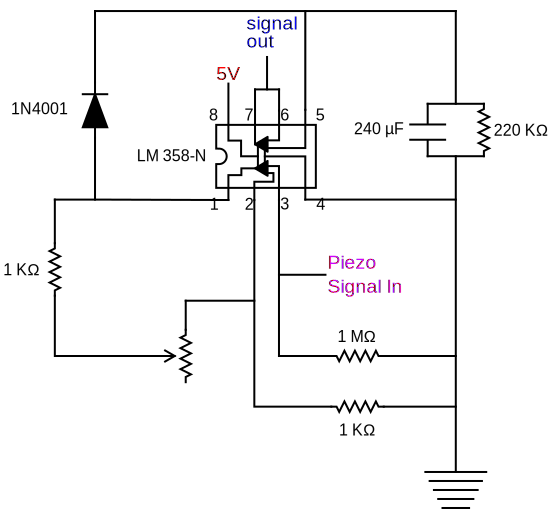

Hardware
========

The basic hardware requirements

Parts List
----------

+-------+------------------------------------------------------------------------------------------------------------------------+
| QTY   | item                                                                                                                   |
+=======+========================================================================================================================+
| 1 ×   | Arduino Uno                                                                                                            |
+-------+------------------------------------------------------------------------------------------------------------------------+
|       | Wires                                                                                                                  |
+-------+------------------------------------------------------------------------------------------------------------------------+
|       | **Amplifier**                                                                                                          |
+-------+------------------------------------------------------------------------------------------------------------------------+
| 1 ×   | `LM358N Op Amp <http://www.ti.com/product/LM358-N>`__                                                                  |
+-------+------------------------------------------------------------------------------------------------------------------------+
| 2 ×   | 1 KΩ resistors                                                                                                         |
+-------+------------------------------------------------------------------------------------------------------------------------+
| 1 ×   | 220 KΩ resistor                                                                                                        |
+-------+------------------------------------------------------------------------------------------------------------------------+
| 1 ×   | 1 MΩ resistor                                                                                                          |
+-------+------------------------------------------------------------------------------------------------------------------------+
| 1 ×   | 240 µF capacitor                                                                                                       |
+-------+------------------------------------------------------------------------------------------------------------------------+
| 1 ×   | 10 Ω - 2 MΩ `trimpot (Bourns 3386) <https://www.digikey.com/catalog/en/partgroup/trimpot-3386-sealed-series/5834>`__   |
+-------+------------------------------------------------------------------------------------------------------------------------+
| 1 ×   | 1N4001 diode                                                                                                           |
+-------+------------------------------------------------------------------------------------------------------------------------+
|       | **Sensor**                                                                                                             |
+-------+------------------------------------------------------------------------------------------------------------------------+
| 1 ×   | `0.6 mm Range Piezo Bender Actuator <http://www.piezodriveonline.com/0-6mm-range-piezo-bender-actuator-ba3502/>`__     |
+-------+------------------------------------------------------------------------------------------------------------------------+
| 1 ×   | blunted 24 G needle                                                                                                    |
+-------+------------------------------------------------------------------------------------------------------------------------+
|       | **Water Delivery / Air Puffer**                                                                                        |
+-------+------------------------------------------------------------------------------------------------------------------------+
| 2 ×   | `24 V DC Solenoid pinch valve PS-1615NC <http://www.takasago-fluidics.com/p/valve/s/pinch/PS/>`__                      |
+-------+------------------------------------------------------------------------------------------------------------------------+
| 2 ×   | `MOSFET RFP30N06LE <https://www.sparkfun.com/products/10213>`__                                                        |
+-------+------------------------------------------------------------------------------------------------------------------------+
| 2 ×   | 1N4001 diode                                                                                                           |
+-------+------------------------------------------------------------------------------------------------------------------------+
| 2 ×   | 10 KΩ resistors                                                                                                        |
+-------+------------------------------------------------------------------------------------------------------------------------+
|       | **Speaker**                                                                                                            |
+-------+------------------------------------------------------------------------------------------------------------------------+
| 1 ×   | `speaker 8Ω 2W  <https://www.digikey.com/product-detail/en/pui-audio-inc/AS07008PO-2-R/668-1191-ND/1738484>`__         |
+-------+------------------------------------------------------------------------------------------------------------------------+
|       | **Stimulus**                                                                                                           |
+-------+------------------------------------------------------------------------------------------------------------------------+
| 1 ×   | `LRA 8mm (precision microdrives) <https://www.precisionmicrodrives.com/product/308-100-8mm-vibration-motor-3mm-type>`__|
+-------+------------------------------------------------------------------------------------------------------------------------+
|       | BNC headers                                                                                                            |
+-------+------------------------------------------------------------------------------------------------------------------------+

Wiring of the Amplifier
-----------------------

Wiring Solenoids
----------------

The air puffer and water delivery system can both be constructed
with the following circuit. This circuit is described in `this blog post from
bildr <http://bildr.org/2012/03/rfp30n06le-arduino/>`__.

Both the air-puffer and water delivery system can be constructed using
solenoid pinch valves. The valves listed above require 24 V DC power supply,
which exceeds that supplied by the Arduino logic pins. This circuit uses a
MOSFET (RFP30N06LE) to gate the solenoid. A 10 KΩ  resistor and diode 
(1N4001) are included to prevent voltage surges from shorting the Arduino.

Wiring the Arduino
------------------

The following table outlines the wiring of the Arduino for the program
in this repository. This indicates the power / signal lines only. Each
of these connections also needs to be wired to the Arduino ground. As
the Uno only has 3 GND pins you have to make an additional set of
headers to wire into.

+-------+-----------------------------------------------------------------+
| pin   | Physical connection                                             |
+=======+=================================================================+
| D3    | short recording trigger (10ms TTL pulse )                       |
+-------+-----------------------------------------------------------------+
| D4    | full trial duration signal (bulb style trigger)                 |
+-------+-----------------------------------------------------------------+
| D5    | Connect to Stimulus device, outputs a variable duration pulse   |
+-------+-----------------------------------------------------------------+
| D6    | Connect to punishment device, (TTL trigger)                     |
+-------+-----------------------------------------------------------------+
| D7    | output to auditory cue speaker                                  |
+-------+-----------------------------------------------------------------+
| D10   | Connect to water valve gated power supply                       |
+-------+-----------------------------------------------------------------+
| A0    | The Piezo Amplifier is connected to the analog input            |
+-------+-----------------------------------------------------------------+
| 5V    | Connect to the power input (5V) of the Piezo linear Amplifier   |
+-------+-----------------------------------------------------------------+

Table: connections
